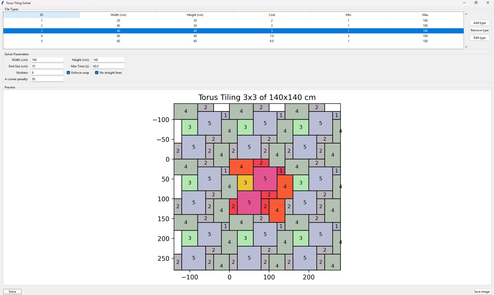

# Torus Tiling

**A Python application for generating non-trivial tile arrangements with toroidal continuity**

---

## Table of Contents

* [Overview](#overview)
* [Core Principles](#core-principles)
* [GUI Features](#gui-features)
* [Requirements](#requirements)
* [Installation](#installation)
* [Running the Application](#running-the-application)
* [Building Executables](#building-executables)
* [Saving Results](#saving-results)
* [Project Structure](#project-structure)
* [License](#license)

---

## Overview

This project solves the **torus tiling** problem using [Google OR-Tools](https://developers.google.com/optimization) and provides a visual, user-friendly interface via Tkinter.

It allows the user to design a tiling layout using multiple tile formats and automatically finds a non-trivial periodic layout that satisfies a strict set of geometric constraints. The resulting pattern is displayed in a **3×3 toroidal tiling preview**, demonstrating seamless periodicity.

---



---

## Core Principles

The solver must place tiles according to these rules:

1. **No overlaps** – tiles must not cover the same area.
2. **No gaps** – the entire surface must be perfectly filled.
3. **Toroidal continuity** – top edge must match the bottom, and left edge must match the right.
4. **Non-trivial boundaries** – straight uninterrupted edges are disallowed.
5. **Tile diversity** – every tile format listed must appear at least once.
6. **Labeling** – each tile is marked with its ID.
7. **Visual output** – shows a 3×3 tiling grid (central tile plus its eight toroidal neighbors).
8. **Optimization** – tile usage is weighted by user-defined cost, and solutions are optimized accordingly.

---

## GUI Features

The graphical interface offers the following:

### **Tile Types Table**
Define tile formats with parameters:
- **ID** – unique integer label
- **Width / Height (cm)** – real-world dimensions
- **Cost** – optimization weight
- **Min / Max Count** – constraints on usage count

Buttons:
- `Add type` – insert a new tile row with default values
- `Edit type` – modify selected row values
- `Remove type` – delete selected tile entry

### **Solver Parameters**
- **Width / Height (cm)** – dimensions of the tiling surface
- **Grid Size (cm)** – unit of discretization (auto-computed from tile GCD)
- **Max Time (s)** – time budget for the solver
- **Workers** – number of threads
- **Enforce wrap** – require top/bottom and left/right continuity
- **No straight lines** – prohibit uninterrupted straight seams
- **4-corner penalty** – weight to discourage perfect 2×2 tile alignment

### **Preview**
- Dynamically updated image showing the tiling pattern
- Central layout plus eight neighbors for visual verification of toroidal constraints

### **Buttons**
- `Solve` – launch the OR-Tools solver
- `Save image` – export preview to PNG

---

## Requirements

* Python 3.8+
* [OR-Tools](https://developers.google.com/optimization)
* [Matplotlib](https://matplotlib.org/)
* [Pillow](https://python-pillow.org/)
* Tkinter (usually bundled with Python)

---

## Installation

```bash
git clone https://github.com/SebastianGruza/TorusTiling.git
cd TorusTiling

python -m venv .venv
source .venv/bin/activate   # Linux/macOS
.\.venv\Scripts\activate    # Windows

pip install -r requirements.txt
```

---

## Running the Application

```bash
python -m gui.gui
```

Fill in the tile types, adjust constraints, and click **Solve** to view the result.

---

## Building Executables

### Windows (.exe)

```powershell
pip install pyinstaller
pyinstaller ^
  --onefile ^
  --windowed ^
  --name TorusTiling ^
  --add-data "core;core" ^
  --collect-binaries ortools ^
  gui\gui.py
```

### Linux (Ubuntu)

```bash
sudo apt install python3-tk
pip install pyinstaller
pyinstaller   --onefile   --name TorusTilingLinux   --add-data "core:core"   gui/gui.py
```

Or run directly:

```bash
python -m gui.gui
```

---

## Saving Results

Click **Save image** to export the current preview as PNG. You will be prompted to choose the file location.

---

## Project Structure

```
TorusTiling/
├── core/
│   └── tiling.py      # Solver and visualization logic
├── gui/
│   └── gui.py         # Tkinter interface
├── requirements.txt
├── README.md
└── ...
```

---

## License

Released under the [MIT License](LICENSE).
